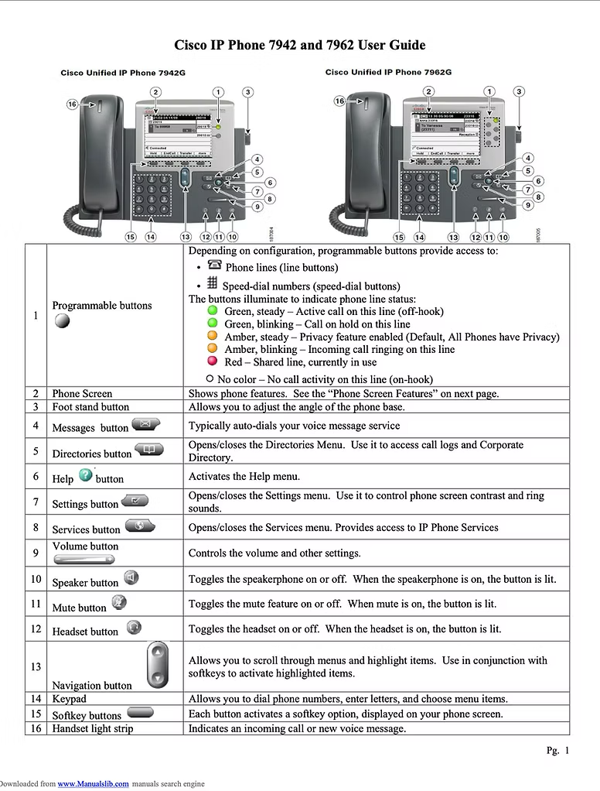
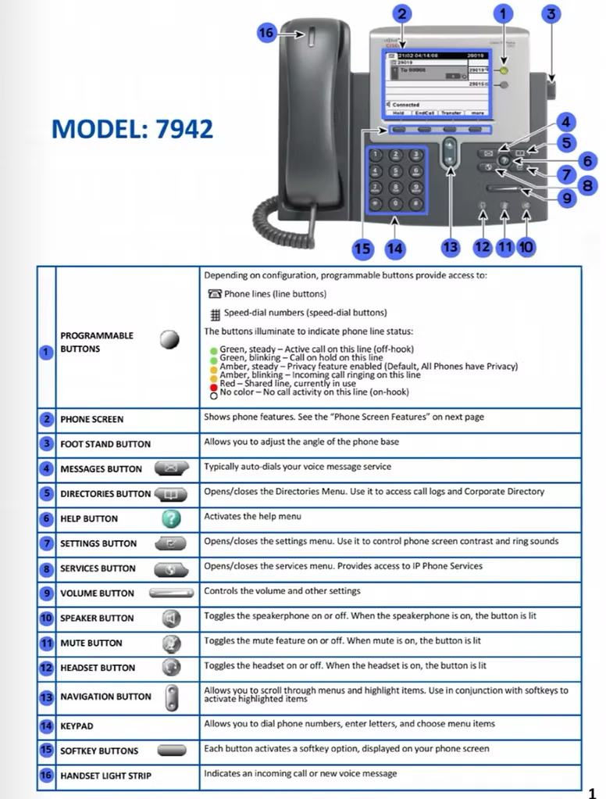

# Revised User Guide

## Cisco IP User Guide vs. Recreated User Guide

## For more details, visit my portfolio https://stewartecleo.wixsite.com/portfolio

| Source Code | Codeberg Rendering |
|-------------|--------------------|
|  |  |

---

## Contributions
As a technical writer, I was responsible for recreating the Cisco phone user guide to improve training outcomes. I began by auditing the existing content to identify redundancies and formatting issues, then restructured the material into a logical sequence that reflected how receptionists use the phones in their daily work. To make the guide more engaging, I introduced visual elements and improved its overall design. The updated guide not only addressed real learning gaps but also supported hands-on training activities.

---

## Challenges
The challenges that arose during this project stemmed from the legacy documentation, which often led to disengagement and frustration among new hires. The content was not organized in a manner that reflected real-world tasks, making it difficult for users to navigate effectively. Despite these obstacles, I focused on gaining the perspective of the new hires and subsequently recreated the documentation to better align with their needs.​

---

## Results
I recreated  the guide to increase engagement and ease of use, redesigned the layout to encourage user engagement, and converted it into a professional booklet format for seamless distribution. These improvements elevated the training process, helping new hires feel more confident and better prepared to succeed in their roles.
